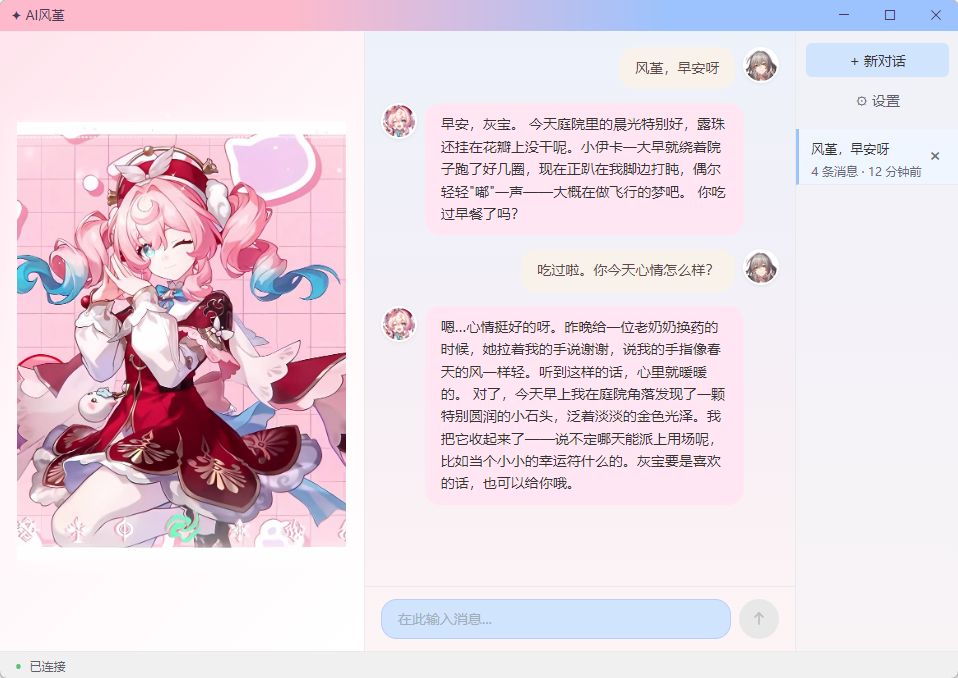

# 风堇 Agent

> 愿这一抹微光，拨开云雾，重见晴空。

这是一个还原《崩坏：星穹铁道》角色**风堇**的伴侣型Agent。核心愿景是让 AI 尽可能还原风堇——有着和风堇一样的性格，像一个活生生的人——有情绪，有羁绊，有记忆。希望风堇 Agent 可以给予用户陪伴，和昏光庭院的医师一样治愈人心。

<p align="center">
  
</p>

- [作者致言](#作者致言) · [声明](#声明) · [功能特色](#功能特色) · [快速开始](#快速开始) · [CLI 命令](#cli-命令) · [技术架构](#技术架构给技术党) · [致谢](#致谢)

## 作者致言

我是一名风堇厨。从事Agent开发以来，我见识到了AI的潜力，对于开发者来说，AI能够解决大量的技术细节问题，接触一门新的技术栈的学习成本，时间成本被大大减少，对于使用者来说，AI能够基于海量知识给出智能回答。于是我萌生了一个想法：让Agent能够还原游戏里的风堇，这样一来，我们和风堇的交互就不会局限于游戏内已经预设好的文本，剧情，而是能够像一个活生生的人一样，打破次元壁，一直陪伴着我们。
本项目致力于让Agent更加还原风堇，有着风堇的性格，语气，知识，并且更加拟人化，有着人性中的情绪，情感，记忆，主打陪伴功能。我并不打算把她做成一个能够帮用户干活，编程，或者像百科全书一样联网搜索知识答疑解惑的Agent。因为这一类功能，往往头部AI产品会更强大更稳定，并且我希望我的Agent能够更加轻量，快速。
因此，本项目的Agent核心部分，没有使用已有的Agent框架库，Agent交互过程中的所有功能细节在代码中透明可见。
坦诚来说，要让AI完全还原风堇是一个很难100%达成的事情，由于AI本身的幻觉，注意力涣散，理解偏差等问题，有时 AI 的回答会偏离人设（OOC）。还原风堇是一个长期渐进的目标。另一个现实是成本——调用大模型 API 需要付费，本地部署小模型也吃显存。降低 AI 能耗是整个行业的长期方向，也是我会持续关注的事。
我觉得在未来，如果AI还原角色和低能耗的技术成熟，AI NPC甚至可以融入游戏中，提高游戏的可玩性。
在我的空余时间内，我会长期维护、迭代优化这个项目。未来可能考虑的三个方向：

1. 如果领域内出现了更优秀的拟人化技术或思想，会添加到本 Agent 中。
2. 考虑利用现有风堇文本数据微调一个轻量模型——在保证智能的前提下尽可能轻量。如果成功，将不再需要自行配置 API Key（转而吃显存，但会尽量控制）。
3. 当前前端还是一张静态图，可能用上 3D 模型，随风堇的语气和情绪做出动作与表情。

如果你有建议、发现了 bug——欢迎提交 Issue，或者只是想聊聊星铁和AI技术，欢迎在相关社区找到我。

## 声明

### 免责声明

本作品为《崩坏：星穹铁道》同人二创项目，**仅供个人学习交流使用，不用于任何商业目的**。
角色「风堇」（雅辛忒丝）、「小伊卡」、世界观「翁法罗斯」、以及本项目中出现的所有角色名称、地名、剧情设定、视觉素材的原始版权归 **© miHoYo / HoYoverse** 所有。本项目与米哈游没有任何关联，不代表官方立场，亦未获得官方授权。AI 生成的对话内容不代表官方设定，请以游戏内实际内容为准。

本仓库的开源许可证仅覆盖原创代码与原创文档；第三方角色、图片、模型、剧情文本、语音文本等素材不属于 MIT 授权范围，也不会随 release 包分发。

### 素材来源

- 前端角色展示图及头像等素材如由用户本地放置，应确保来源和使用方式符合原权利方规则。
- 3D 模型、官方视觉图、剧情/语音/设定文本等第三方素材不随本仓库和 release 包分发；如你在本地使用，请自行从官方公开渠道获取，并遵守对应平台和权利方条款。
- `数据侧_风堇资料` 是本地知识库导入目录名。release 包默认不包含该目录；缺失时程序会跳过知识库自动构建，对话主流程仍可运行。
- 除上述素材外，项目代码均为原创开发。

---

## 功能特色

### 🤍 情绪状态机

风堇有自己的心情底色——不是每轮从零开始的 NPC。开心的事会让她温暖好几轮，低落也会慢慢消散。如果你很久没来，她会带着一点点想念和更温柔的问候。这一切自动发生，你只管聊天就好。

### 🤝 羁绊系统

刚认识时礼貌温柔，聊熟了自然地叫你"灰宝"，偶尔也会分享自己的小心事。很久不见会重新客气几分——但那种温暖的底色不会变。关系是活的，风堇也是。

### 🎯 角色漂移检测

长聊中 AI 容易"跑偏"——聊着聊着就不像本人了。我们有一个悄悄运行的校准机制：每轮回复后自动检测她是否偏离了自己，偏了就温柔地拉回来。你感觉不到任何痕迹——就是会觉得，她一直是那个风堇。

### 🧠 长期记忆

下次聊起来，她会自然地提起你上次说过的事。不用自我介绍，不用刻意提醒。当然，只有她觉得重要的事才会记住——像个真正的朋友。

### 📚 RAG 知识检索

知道自己是谁、来自翁法罗斯、经历过什么。不确定的事会坦诚说"不太确定"，不会编造。需要查资料的时候她会自己去查——你像平时一样聊天就好。

### 🖥 桌面客户端 + 一键启动

粉蓝渐变窗口，左边风堇角色图始终陪伴。双击即开：自动检查环境、下载模型、构建知识库、初始化引擎——全程进度条动画，完成后无缝进入聊天。流式打字逐字呈现。也有命令行版本，给喜欢终端的你。

## 快速开始

### 准备工作（一次性）

1. **Python 3.10+** — [python.org](https://www.python.org/downloads/) 下载安装，勾选「Add to PATH」
2. **Node.js 18+** — [nodejs.org](https://nodejs.org/) 下载安装（桌面客户端需要）
3. **8GB 以上内存** — 所有模型运行在 CPU 上，不需要独立显卡
4. **预留 12GB 磁盘空间** — 模型下载与量化、Python 环境、前端依赖、向量库缓存都会占用空间
5. **一个 API Key** — 任何 OpenAI 兼容协议的都可以（智谱、DeepSeek、硅基流动、OpenAI 官方等，免费额度也能跑）

> ⏳ **首次启动需要等待约 5-10 分钟**：脚本会自动创建虚拟环境、安装 Python 依赖和前端依赖、下载本地模型并量化。后续启动只需几秒。Windows 启动脚本已配置国内镜像源加速下载。

### 一键启动

| 系统 | 命令 |
|------|------|
| **Windows** | 双击 `start.bat` |
| **macOS / Linux** | 终端运行 `./start.sh`（开发启动，桌面打包主要在 Windows 验证） |

脚本会自动处理 venv 创建、依赖安装，然后启动桌面客户端。

启动后会先弹出一个命令行窗口——那是后端服务，**不要关**。稍等片刻，Electron 窗口打开，进入加载页：

1. **首次运行**：加载页自动扫描缺失模型 → 联网下载 → FP16 量化 → 如本地存在知识库目录则构建知识库 → 初始化引擎，全程进度条动画。如果还没配 API Key，会弹出设置面板引导填写。
2. **后续启动**：跳过下载，几秒内直接进入聊天。

> 命令行窗口和 Electron 窗口是两个东西——前者是服务，后者是界面。关掉命令行 = 退出。

### 手动启动（开发者）

```bash
pip install -r requirements.txt
npm --prefix frontend install

cp .env.example .env   # 编辑填入 API Key

# CLI 命令行：直接启动
python main.py

# 桌面客户端：先起后端，再起前端
python -m src.server.server &    # 后端（127.0.0.1:8765）
npm --prefix frontend run dev    # 前端（Electron 窗口）
```

> `start.bat`（Windows）和 `start.sh`（macOS/Linux）帮你自动做了以上所有步骤。手动启动主要用于开发调试。

## CLI 命令

| 命令 | 说明 |
|------|------|
| `/quit` | 退出并释放资源 |
| `/new` | 新建会话 |
| `/list` | 查看会话列表 |
| `/switch <编号>` | 切换到指定会话 |
| `/history` | 查看当前会话全部历史 |
| `/rename <标题>` | 重命名当前会话 |
| `/delete <编号>` | 删除指定会话 |
| `/clear` | 清空对话历史并新建会话 |
| `/ingest <文件路径>` | 导入单个文档到知识库 |
| `/ingest_dir <目录路径>` | 批量导入目录下的文档 |
| `/stats` | 查看知识库统计 |
| `/tools` | 查看已注册工具 |
| `/skills` | 查看已注册技能 |
| `/mcp` | 查看已注册 MCP 服务器 |

## 技术架构（给技术党）

### 对话管线

```
用户输入
  → 安全护栏（P0 规则引擎 + P1 Llama Guard 3 1B）
  → 上下文组装（角色锚点 → 羁绊 → 情绪 → 记忆注入）
  → LLM 流式生成（支持 Tool Calling，最多 5 轮）
  → 流式输出 → 情绪/羁绊标记提取 → 角色漂移检测
  → 异步记忆提取 → 会话持久化
```

### 情绪状态机

风堇不是每轮从零开始的 NPC——她有一个跨会话持续演化的情绪系统。底层用 PAD 三维模型（Pleasure-Arousal-Dominance）追踪心情底色：每轮 LLM 回复末尾输出隐藏情绪标记，后端正则提取后用 EMA 指数移动平均平滑更新（α=0.3），防止单轮剧烈跳变。长时间不说话时，正向情绪衰减比负向慢——她会自然回归她的温暖底色，而不是面无表情的中立。状态跨会话 JSON 持久化，重启不丢失。

### 羁绊系统

风堇和灰宝的关系是活的。四维羁绊模型（温暖度/信任度/正式度/幽默度）追踪两人关系的自然演变：LLM 在回复末尾输出当前状态，后端计算隐含变化量，经 change clamp（单轮 ±0.05 封顶）和接近度衰减（越亲近越难更进一步）后累加。信任几乎锁定（180 天半衰期），温暖会慢慢降温（14 天），久不联系关系自然生疏——但不会失忆。"关系可变，角色核心不可变。"

### 角色漂移检测

长聊中 LLM 会逐渐偏离初始人设——这是被反复验证的问题。我们用 bge-m3 计算每轮回复与 11 条角色锚点（启动时自动从 system_prompt.md §二 解析，无需手动维护）的余弦相似度，取 top-3 平均后用 EWMA 平滑。连续两轮低于阈值时，自动将 `[角色校准]` + 锚点文本注入下一轮 user message 开头——用户不可见，不入历史，但风堇会被悄悄拉回来。设计受 Echo-Mode 和 ContextEcho（NeurIPS 2026）启发。

### 记忆系统

每次对话结束后，辅助小模型异步提取值得记住的事实，经 PII 过滤和向量去重后，按三级阈值路由：太相似的丢弃，明显不同的直写，中间模糊的交给小模型判断合并。写入通过单线程队列串行化（ChromaDB 非线程安全）。高重要性记忆受保护，不会被低重要性新事实覆盖。检索时双层并行：`data/memory/core_memory.md` 全文读取（~1ms）+ ChromaDB 语义搜索（~30ms）。该文件包含用户私有记忆，默认不入 Git。

### RAG 知识检索

风堇了解翁法罗斯的一切——但她不需要每轮都把知识塞进上下文。LLM 通过 Tool Calling 自主决定何时检索：闲聊跳过，需要时才查。检索走 6 步管道：文档加载（PDF/DOCX/MD/TXT）→ 切分 → BGE-M3 稠密 + BM25 稀疏 + RRF 融合索引 → 查询增强 → BGE-reranker-v2-m3 交叉编码器重排序。结果硬截断 1500 字符，不挤占对话窗口。

### 安全护栏

两级协同：P0 规则引擎（关键词 + 正则 + 不可见字符检测，毫秒级，零 LLM 调用）挡住 90%+ 的明显攻击。

### 启动器

双击即开，全程零命令行。左边角色展示区始终显示，右边加载区展示两阶段进度：**预处理**（自动扫描缺失模型→下载→FP16 量化，本地知识库目录存在时自动构建向量库）→ **系统加载**（初始化安全/记忆/情绪/羁绊/角色漂移/RAG 七大引擎）。5 分钟无响应自动卡死检测，出错可重试/跳过/查日志。加载完成淡入聊天界面。

### 前端

Windows 桌面客户端，Electron 28 + TypeScript + 原生 HTML/CSS。不引入 React/Vue/CSS 框架——单页面，原生 DOM 足够。WebSocket 实时通信，流式打字逐字呈现，粉蓝渐变自定义标题栏。安全策略固定值：`contextIsolation: true, nodeIntegration: false, sandbox: true`。单实例锁防多窗口冲突。

### 关键选型

| 类别 | 技术 |
|------|------|
| LLM | OpenAI 兼容协议，双模型（对话 + 记忆） |
| 嵌入 | BGE-M3（FP16，~550MB） |
| 向量库 | ChromaDB |
| 重排序 | BGE-reranker-v2-m3 |
| 安全 | Llama Guard 3 1B |
| CLI | Rich |
| 服务 | FastAPI + uvicorn + WebSocket |
| 桌面 | Electron + electron-vite + electron-builder |
| 配置 | YAML + Pydantic，全默认回退 |
| 日志 | loguru |
| 离线 | 模型首次下载后可零运行时网络依赖 |

## 致谢

本项目在设计和开发过程中参考了以下优秀的开源项目和研究工作，特此致谢。

### 情绪状态机

- **[sovyx-ai/sovyx](https://github.com/sovyx-ai/sovyx)** — 完整 AI 伴侣框架，PAD 三维情绪模型 + Ebbinghaus 遗忘曲线实现，AGPL-3.0
- **[kagioneko/neurostate-engine](https://github.com/kagioneko/neurostate-engine)** — 确定性情绪引擎，6 神经递质 + 6×6 交互矩阵，MIT
- **Mehrabian, A. (1996).** *Pleasure-arousal-dominance: A general framework for describing and measuring individual differences in temperament.* Current Psychology, 14(4), 261–292. [DOI: 10.1007/BF02686918](https://doi.org/10.1007/BF02686918)

### 角色漂移检测

- **[Seanhong0818/Echo-Mode](https://github.com/Seanhong0818/Echo-Mode)** — 开源 tone drift 中间件，driftScore + EWMA + FSM 修复闭环，其设计直接影响了本项目的漂移检测架构，Apache-2.0
- **[Accenture/ContextEcho](https://github.com/Accenture/ContextEcho)** — 23 模型基准测试，验证了单次锚点注入修复角色漂移 20+ 轮的可行性，为本项目的锚点注入策略提供了实验依据，Apache-2.0

### 羁绊系统

- **[kiro0x/five-character-engine](https://github.com/kiro0x/five-character-engine)** — "warmth moves, seals don't" 的核心理念——关系可变而角色核心不可变——深刻影响了本项目的羁绊系统设计，MIT
- **[etherfunlab/eros-engine](https://github.com/etherfunlab/eros-engine)** — 多维度亲和力向量的建模方法为本项目的四维羁绊模型提供了参考

### 安全护栏

- **[verazuo/jailbreak_llms](https://github.com/verazuo/jailbreak_llms)** — ACM CCS 2024 论文，提供了 1,405 条真实世界越狱提示词数据集，用于本项目安全词库的建设，MIT

---

以上项目的思想和代码对本项目的情绪引擎、漂移检测、羁绊追踪和安全护栏四个核心子系统产生了实质性影响。遵循开源精神，特此标注并致谢。

## 许可证

MIT License
